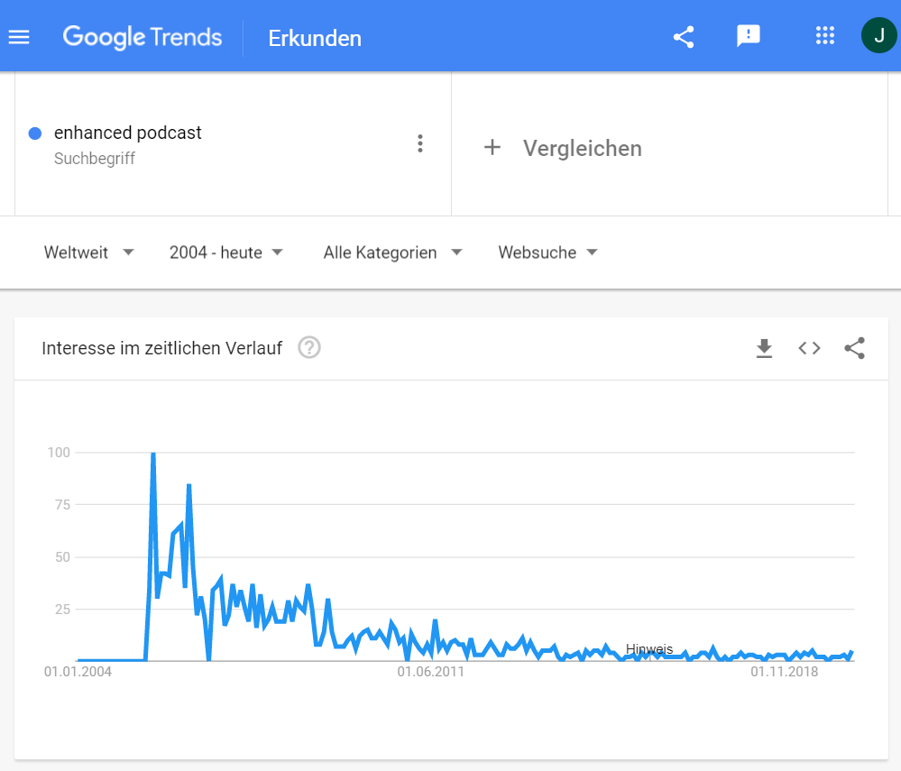
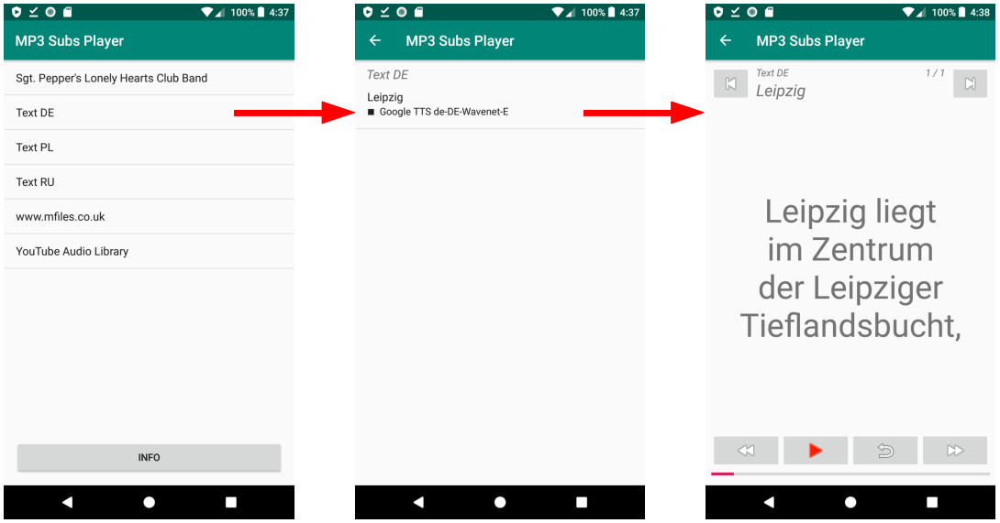

# MP3 Subs player

This is a prototype (or design study) of an Android MP3 player app, showing subtitles. The subtitles must be stored in the "composer" frame of the ID3 tag in SRT format. The MP3 file TTS_Google_de-DE-Wavenet-E.mp3 is example content for that player. The player is considered a newly designed enhanced podcast player.

This way, let's revitalize an old and forgotten idea, the so called enhanced podcast. The idea is from 2005, as shown in this Google Trends diagram. This original idea is from Apple. See also the definition of enhanced podcast at PCMag encyclopedy [1].

An enhanced podcast is an audio record stored in a single file together with additional information and interactivity. The listener experience, of course, includes listening to an audio record and the navigation between chapters. Images and other multimedia features are possible. 

The goal of this new project is a prototype or design study of a MP3 player. This player shows lyrics in an almost karaoke style way, and allows easy navigation within the audio. The support of images may be added later. The additional data is stored in the ID3 tag of the MP3 file. This player runs on Android smartphones and tablets. 

So, this prototype is not an exact remake of the original enhanced podcast. It is a design study, made in order to test new UI features. The target users for this player are students, learning foreign languages from enhanced podcasts.

The original enhanced podcasts are build upon Apples m4a audio file format. In this new project uses the MP3 file format instead. And, instead of navigating between chapters, the navigation is between subtitles.

What is your experience of this player? Check it out! You can import this Github project into Android Studio, than run it on an Android device. The project contains the MP3 file __TTS_de-DE-Wavenet-E.mp3__ with subtitles for this player app. (You need to restart the app, if you imported an MP3 file after launching the player. This is a bug, that will be fixed later.)

The wireframe showsnthe three activities. First is MainActivity. It shows a list view of all the music albums, provided by the media store. You select an album by tapping on it. Second is TitleActivity. It shows a list view of all the titles of the album selected. You select a title by tapping on it. This opens the last activity, the PlayerActivity. The audio playing is started. 

The user interaction concept is: During the audio is playing, one can see synchronous subtitles. One can navigate to a previous or to a following subtitle by tapping at the left and right double arrow buttons at the bottom. Pay attention, that the playing each time starts at the start of the subtitle! So it is easy to repeat the title last heared. With a tap on the play button one can pause the playing. One can repeat the actual subtitle by tapping at the repeat button next to the play button. At the top of the screen at the left and the right side there are buttons for navigation to the previous and the following title in the album. For choosing another album, one needs to return to the MainActivity.

Actually, this prototype player expects subtitles to be in the TCOM frame (the composer frame) of the ID3 tag of the MP3 file. They must be in formatted in the SRT format. In this data, all newlines must be replaced by '&lt;br&gt;', since newlines are not allowed in the TCOM frame. In later development, the subtitles will be stored in either a SYLT or a custom frame of the ID3 tag, so that the TCOM frame is no longer misused. The TCOM frame has been chosen, because an Android developer can use it very easy, since it's data is accessable  in the media store.

### See also

[1]	PCMag encyclopedy: Definition of enhanced podcast,
https://www.pcmag.com/encyclopedia/term/enhanced-podcast 

